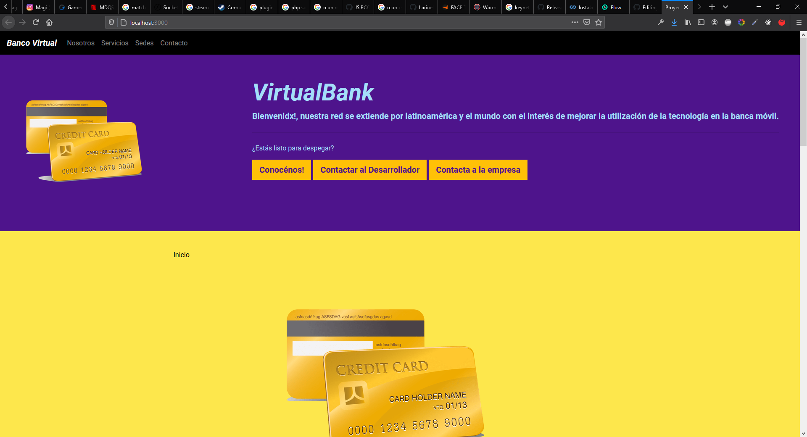

# Curso Bootstrap 4 : Banco Virtual
Proyecto final para el curso de Bootstrap 4 de la Universidad Austral

# Preview

# Instalación
Para ver la demo desde un entorno local, seguí los siguientes pasos:

- Clona el repositorio en tu entorno local.
- Corre desde una terminal el comando "npm install"
- Corre el comando "npm run dev" para correr el servidor con lite-server
